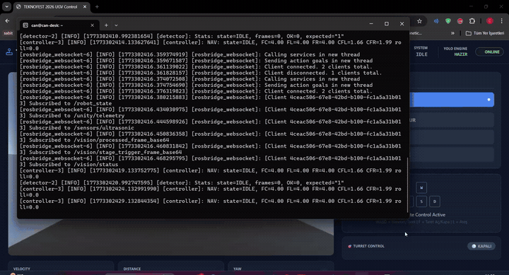
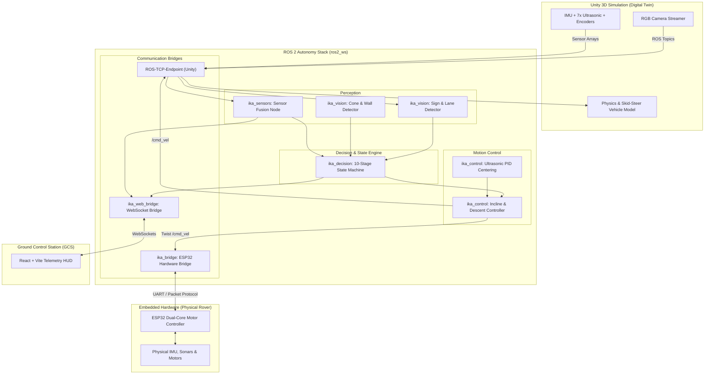
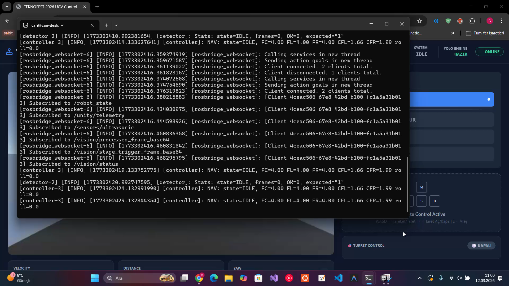

# 🚜 Autonomous UGV — Zero-LiDAR Autonomy Stack & Digital Twin
### TEKNOFEST 2026 İnsansız Kara Aracı (İKA) Otonomi ve Dijital İkiz Sistemi

[](https://docs.ros.org/)
[](https://unity.com/)
[](https://www.python.org/)
[](https://isocpp.org/)
[](https://platformio.org/)
[](https://vitejs.dev/)
[](LICENSE)

---

<p align="center">
  
  <br>
  <em><b>Canlı Otonomi Simülasyonu:</b> Unity 3D Dijital İkiz Parkuru, Gerçek Zamanlı Kamera Algılama ve Web Telemetri HUD Arayüzü</em>
</p>

---

## 📖 Proje Hakkında (Project Overview)

Bu proje, **TEKNOFEST 2026 İnsansız Kara Aracı (İKA)** yarışması için geliştirilmiş, maliyetli LiDAR sensörlerine ihtiyaç duymadan (**Zero-LiDAR**) çalışan, **Bilgisayarlı Görü (Computer Vision)** ve **Sensör Füzyonu** odaklı tam otonom bir kara aracı mimarisidir.

Sistem; yüksek çözünürlüklü bir **Unity 3D Dijital İkiz Simülasyonu**, modüler **ROS 2 Otonomi Yığını**, çift çekirdekli **ESP32 Donanım Sürücüleri** ve operatörler için geliştirilmiş modern bir **Web Telemetri Paneli (Ground Control Station)** bileşenlerini tek bir çatı altında birleştirir.

---

## 🌟 Öne Çıkan Özellikler (Key Highlights)

- 👁️ **LiDAR'sız Saf Bilgisayarlı Görü (Zero-LiDAR Perception):**
  - Hough Circle ve Kontur Daireselliği (*Circularity: $4\pi \cdot \text{Area} / \text{Perimeter}^2$*) algoritmaları ile 1-10 arası etap tabelaları, STOP ve HEDEF işaretlerini milisaniyeler içinde ayırt etme.
  - HSV renk uzayında dinamik adaptasyon ile turuncu trafik konileri (slalom) ve hareketli beyaz kayar engelleri segmentasyon yeteneği.
- 🎮 **Fotogerçekçi Unity 3D Dijital İkiz (Digital Twin):**
  - TEKNOFEST 2026 şartnamesine birebir uygun 10 etaplık 3D parkur modelleri (dik eğim, su geçişi, yan eğim, engebeli zemin, çakıllı yol).
  - 4 tekerden bağımsız süspansiyon, skid-steer dönüş tork desteği ve tank sürüş dinamiği (`RoverController.cs`).
  - Unity <-> ROS 2 çift yönlü köprü (`ROS-TCP-Endpoint` ve `RosBridgeClient.cs`).
- 🧠 **10 Etaplı Akıllı Durum Makinesi (State Machine):**
  - Görev aşamalarını (başlangıç, yan eğim, slalom, kayar engel, dik rampa tırmanışı, platform hedef atışı, dik iniş ve bitiş) IMU eğim açıları (pitch/roll) ve sensör geri bildirimleriyle otonom yöneten karar mekanizması.
- ⚡ **Gömülü Sistem & Donanım Füzyonu (Embedded & Hardware):**
  - ESP32 çift çekirdekli gerçek zamanlı motor PWM denetimi ve UART telemetrisi.
  - 7 kanallı ultrasonik yaklaşım dizilimi (Front, Corners, Sides) ile duvar izleme ve dinamik koridor merkezleme PID kontrolü.
- 📊 **Canlı Web Yer Kontrol İstasyonu (GCS Web HUD):**
  - React + Vite + Tailwind ile geliştirilmiş, robot durumunu, hızını, IMU açılarını, kamera akışını ve ultrasonik mesafe haritasını canlı gösteren telemetri arayüzü.

---

## 📐 Sistem ve Veri Akışı Mimarisi (Architecture)



---

## 🏆 TEKNOFEST 2026 Parkur Etapları ve Otonomi Stratejisi

| # | Etap Adı | Algılama Yöntemi | Kontrol & Navigasyon Stratejisi |
|---|---|---|---|
| **1** | **Başlangıç & Düz Yol** | Tabela 1 (Daire Kontur) + Çizgi Takibi | Çift ultrasonik köşe sensörü ile PID şerit ortalama |
| **2** | **Taşlı / Çakıllı Yol** | Tabela 2 Tespiti | Düşük hız, yüksek tork ve skid-steer çekiş kontrolü |
| **3** | **Yan Eğim Parkuru** | Tabela 3 + IMU Roll Açısı Ölçümü | Roll açısı dengelemesi için sağ duvara yanaşma offseti (-0.5m) |
| **4** | **Dik Engel** | Tabela 4 + Ön Ultrasonik Sensörler | Ön mesafe < 0.6m olduğunda dinamik baypas manevrası |
| **5** | **Trafik Konileri (Slalom)** | Tabela 5 + HSV Turuncu Segmentasyon | Konilerin kütle merkezine göre sağ-sol alternatif slalom açısı |
| **6** | **Kayar Engel (Dinamik Duvar)** | Tabela 6 + Ön 3x Ultrasonik + Optik Akış | Duvar hareket periyodu analizi, güvenli aralıkta hızlı geçiş |
| **7** | **Engebeli Arazi** | Tabela 7 + IMU Pitch/Roll Filtresi | Süspansiyon sönümleme için kontrollü sürünme hızı |
| **8** | **Dik Eğim Çıkış** | Tabela 8 + IMU Pitch < -20° | 2 saniye eğim doğrulama duruşu $\rightarrow$ %60 takviyeli motor gücü ile tırmanma |
| **9** | **Platform & Hedef Atış** | Platform Tespiti (Pitch $\approx$ 0°) | Platformda tam duruş $\rightarrow$ Lazer hedef kilitlenmesi (3 sn) |
| **10** | **Dik İniş & Bitiş** | Tabela 10 + IMU Pitch > +20° | Geri vites darbesi ile momentum kırma (0.5s) $\rightarrow$ 2s sert fren $\rightarrow$ Yavaş iniş $\rightarrow$ FİNİTO |

---

## 📂 Dizin Yapısı (Project Structure)

```text
UGV-Without-Lidar-Sensor/
├── ros2_ws/                         # ROS 2 Otonomi Yığını (Colcon Workspace)
│   └── src/
│       └── ika_robot/
│           ├── ika_decision/        # 10 Etaplı Parkur Durum Makinesi (State Machine)
│           ├── ika_vision/          # Görüntü İşleme, Tabela ve Engel Algılama
│           ├── ika_control/         # PID, Eğim Tırmanma/İniş ve Hız Kontrolü
│           ├── ika_sensors/         # IMU + Enkoder + Ultrasonik Sensör Füzyonu
│           ├── ika_bridge/          # Unity ROS-TCP ve Donanım Seri Köprüsü
│           ├── ika_interfaces/      # Özel ROS 2 Arayüz Tanımları (SignDetection.msg)
│           ├── ika_bringup/         # Başlatma Dosyaları (system.launch.py)
│           └── ika_web_bridge/      # Web Paneli için Telemetri Köprüsü (WebSocket)
│
├── simulation/                      # Unity 3D Dijital İkiz Simülasyonu
│   ├── Assets/
│   │   ├── Parts3d/                 # İKA Şasi ve Parçaları (Yüksek Kaliteli 3D CAD Modelleri)
│   │   ├── Deneme/                  # TEKNOFEST 2026 Parkur 3D Modelleri (OBJ, STL, MTL)
│   │   ├── Scenes/                  # harita.unity, parkur.unity, SampleScene.unity
│   │   ├── Scripts/                 # RoverController, RosBridgeClient, Sensör C# Scriptleri
│   │   ├── Prefabs/                 # Ön Tanımlı Araç ve Sensör Prefabları
│   │   └── Materials/               # Kaplama ve Fizik Materyalleri
│   ├── Packages/
│   └── ProjectSettings/
│
├── firmware/                        # Gömülü Sistem Kodları
│   ├── esp32/                       # ESP32 Motor Sürücü & Telemetri Firmware (C++/PlatformIO)
│   └── stm32_legacy/                # STM32 HAL C Sürücüleri (İlk Donanım Prototipi)
│
├── dashboard/                       # Yer Kontrol İstasyonu (GCS)
│   ├── src/                         # React + Vite + Tailwind Canlı Telemetri HUD
│   ├── package.json
│   └── vite.config.js
│
├── docs/                            # Sistem Mimarisi ve Belgeler
│   ├── diagrams/                    # Karar Akışı ve Veri Akışı SVG Şemaları
│   │   ├── decision_flowchart.svg
│   │   └── data_flow_diagram.svg
│   └── specifications/              # TEKNOFEST 2026 İKA Şartnamesi PDF
│
├── legacy/                          # İlk Prototip Arşivi
│   └── early_cv_prototype/          # İlk saf OpenCV ve Python test scriptleri
│
├── scripts/                         # Otomasyon ve Kurulum Araçları
│   ├── setup_wsl.sh                 # WSL/Ubuntu ortam kurulum betiği
│   ├── setup_ros_tcp.sh             # ROS-TCP-Endpoint derleme betiği
│   └── install_deps.sh              # Python ve ROS bağımlılık yükleyicisi
│
├── .gitignore                       # Unity, ROS 2, Python, Node, C++ için kapsamlı kurallar
├── .gitattributes                   # Unity modelleri (.stl, .obj, .fbx) için Git LFS kuralları
└── README.md
```

---

## 🚀 Hızlı Başlangıç (Quick Start Guide)

### 1. Ön Gereksinimler
- **Ubuntu 22.04 (ROS 2 Humble)** veya **Ubuntu 24.04 (ROS 2 Jazzy)** (WSL2 desteklenir)
- **Unity Hub & Unity Editor** (2022.3 LTS veya 6000 LTS)
- **Node.js** (v18+) & **npm**
- **Git LFS** (`git lfs install`)

### 2. Depoyu Klonlama (Git LFS ile)
```bash
git clone https://github.com/canakbass/UGV-Without-Lidar-Sensor.git
cd UGV-Without-Lidar-Sensor
git lfs pull
```

### 3. ROS 2 Otonomi Yığınını Derleme & Başlatma
```bash
# Ortam ve bağımlılık kurulumu
bash scripts/setup_wsl.sh
bash scripts/setup_ros_tcp.sh

# Çalışma alanını derleme
cd ros2_ws
colcon build --symlink-install
source install/setup.bash

# Tüm otonomi sistemini başlatma
ros2 launch ika_bringup system.launch.py
```

### 4. Unity Simülasyonunu Açma
1. Unity Hub'ı açın.
2. `Add project from disk` seçeneği ile bu depodaki `simulation/` klasörünü seçin.
3. `Assets/Scenes/parkur.unity` veya `harita.unity` sahnesini açıp **Play** butonuna basın.
4. Araç, ROS 2 düğümleriyle otomatik olarak haberleşmeye başlayacaktır.

### 5. Web Telemetri Dashboard'ını Başlatma
```bash
cd dashboard
npm install
npm run dev
```
Tarayıcınızda `http://localhost:5173` adresine giderek aracı anlık olarak izleyebilir ve telemetri verilerini görüntüleyebilirsiniz.

## 📊 Sistem Şemaları ve Ekran Görüntüleri

<p align="center">
  
  <br>
  <em><b>Yer Kontrol İstasyonu (GCS):</b> ROS 2 Düğümleri, WebSocket Köprüsü ve Canlı Telemetri Paneli</em>
</p>

- 📄 **[TEKNOFEST 2026 İnsansız Kara Aracı Şartnamesi](docs/specifications/TEKNOFEST_2026_UGV_Spec.pdf)**
- 🗺️ **[Karar Verme Akış Şeması](docs/diagrams/decision_flowchart.svg)**
- 🔄 **[Veri Akış Şeması](docs/diagrams/data_flow_diagram.svg)**

---

## 👤 Geliştirici (Author)

- **Can Akbaş** — [GitHub (@canakbass)](https://github.com/canakbass) — [İletişim](mailto:canakbasforspecial@gmail.com)

---

## 📜 Lisans (License)

Bu proje [MIT Lisansı](LICENSE) altında korunmaktadır. Eğitim, araştırma ve TEKNOFEST yarışma çalışmaları için serbestçe kullanılabilir.
